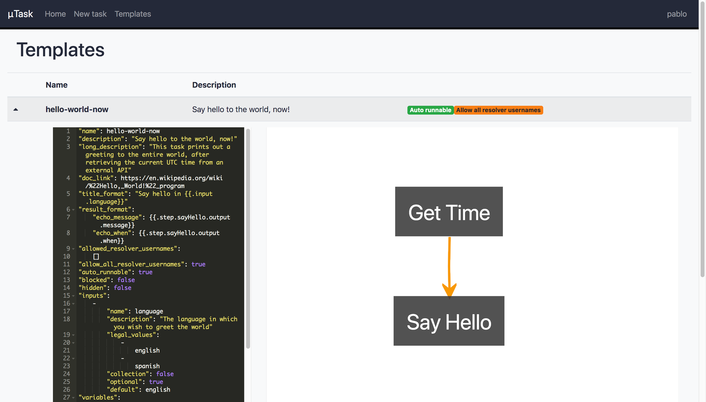

# µTask, the Lightweight Automation Engine

[](https://travis-ci.org/ovh/utask)
[](https://goreportcard.com/report/github.com/ovh/utask)
[](https://coveralls.io/github/ovh/utask?branch=master)
[](https://godoc.org/github.com/ovh/utask)
[](https://github.com/ovh/utask/stargazers)

[](https://github.com/ovh/utask/blob/master/LICENSE)

µTask is an automation engine built for the cloud. It is:
- **simple to operate**: only a postgres DB is required
- **secure**: all data is encrypted, only visible to authorized users
- **extensible**: you can develop custom actions in golang

µTask allows you to model business processes in a **declarative yaml format**. Describe a set of inputs and a graph of actions and their inter-dependencies: µTask will asynchronously handle the execution of each action, working its way around transient errors and keeping an encrypted, auditable trace of all intermediary states until completion.


## Table of contents

- [Real-world examples](#examples)
- [Quick Start](#quickstart)
- [Operating in production](#operating)
- [Configuration](#configuration)
- [Authoring Task Templates](#templates)
- [Extending µTask with plugins](#plugins)
- [Contributing](#contributing)
- [License](#license)

## Real-world examples <a name="examples"></a>

Here are a few real-world examples that can be implemented with µTask:

### Kubernetes ingress TLS certificate provisioning

A new ingress is created on the production kubernetes cluster. A hook triggers a µTask template that:
- generates a private key
- requests a new certificate
- meets the certificate issuer's challenges
- commits the resulting certificate back to the cluster

### New team member bootstrap

A new member joins the team. The team leader starts a task specifying the new member's name, that:
- asks the new team member to generate an SSH key pair and copy the public key in a µTask-generated form
- registers the public SSH key centrally
- creates accounts on internal services (code repository, CI/CD, internal PaaS, ...) for the new team member
- triggers another task to spawn a development VM
- sends a welcome email full of GIFs

### Payments API asynchronous processing

The payments API receives a request that requires an asynchronous antifraud check. It spawns a task on its companion µTask instance that:
- calls a first risk-assessing API which returns a number
- if the risk is low, the task succeeds immediately
- otherwise it calls a SaaS antifraud solution API which returns a score
- if the score is good, the task succeeds
- if the score is very bad, the task fails
- if it is in between, it triggers a human investigation step where an operator can enter a score in a µTask-generated form
- when it is done, the task sends an event to the payments API to notify of the result

The payments API keeps a reference to the running workflow via its task ID. Operators of the payments API can follow the state of current tasks by requesting the µTask instance directly. Depending on the payments API implementation, it may allow its callers to follow a task's state.

## Quick start <a name="quickstart"></a>

### Running with docker-compose

Download our latest install script, setup your environment and launch your own local instance of µTask.

```bash
mkdir utask && cd utask
wget https://github.com/ovh/utask/releases/latest/download/install-utask.sh
sh install-utask.sh
docker-compose up
```

All the configuration for the application is found in the environment variables in docker-compose.yaml. You'll see that basic auth is setup for user `admin` with password `1234`. Try logging in with this user on the graphical dashboard: [http://localhost:8081/ui/dashboard](http://localhost:8081/ui/dashboard).

You can also explore the API schema: [http://localhost:8081/unsecured/spec.json](http://localhost:8081/unsecured/spec.json).

Request a new task:


Get an overview of all tasks:


Get a detailed view of a running task:


Browse available task templates:


### Running with your own postgres service

Alternatively, you can clone this repository and build the µTask binary:

```bash
make all
```

## Operating in production <a name="operating"></a>

The folder you created in the previous step is meant to become a git repo where you version your own task templates and plugins. Re-download and run the latest install script to bump your version of µTask.

You'll deploy your version of µTask by building a docker image based on the official µTask image, which will include your extensions. See the Dockerfile generated during installation.

### Architecture

µTask is designed to run a task scheduler and perform the task workloads within a single runtime: work is not delegated to external agents. Multiple instances of the application will coordinate around a single postgres database: each will be able to determine independently which tasks are available. When an instance of µTask decides to execute a task, it will take hold of that task to avoid collisions, then release it at the end of an execution cycle.

A task will keep running as long as its steps are successfully executed. If a task's execution is interrupted before completion, it will become available to be re-collected by one of the active instances of µTask. That means that execution might start in one instance and resume on a different one.

### Maintenance procedures

#### Key rotation

1. Generate a new key with [symmecrypt](https://github.com/ovh/symmecrypt), with the 'storage' label.
2. Add it to your configuration items. The library will take all keys into account and use the latest possible key, falling back to older keys when finding older data.
3. Set your API in maintenance mode (env var or command line arg, see config below): all write actions will be refused when you reboot the API.
4. Reboot API.
5. Make a POST request on the /key-rotate endpoint of the API.
6. All data will be encrypted with the latest key, you can delete older keys.
7. De-activate maintenance mode.
8. Reboot API.

### Dependencies

The only dependency for µTask is a Postgres database server. The minimum version for the Postgres database is 9.5

## Configuration 🔨 <a name="configuration"></a>

### Command line args

The µTask binary accepts the following arguments as binary args or env var.
All are optional and have a default value:
- `init-path`: the directory from where initialization plugins (see "Developing plugins") are loaded in *.so form (default: `./init`)
- `plugins-path`: the directory from where action plugins (see "Developing plugins") are loaded in *.so form (default: `./plugins`)
- `templates-path`: the directory where yaml-formatted task templates are loaded from (default: `./templates`)
- `functions-path`: the directory where yaml-formatted functions templates are loaded from (default: `./functions`)
- `region`: an arbitrary identifier, to aggregate a running group of µTask instances (commonly containers), and differentiate them from another group, in a separate region (default: `default`)
- `http-port`: the port on which the HTTP API listents (default: `8081`)
- `debug`: a boolean flag to activate verbose logs (default: `false`)
- `maintenance-mode`: a boolean to switch API to maintenance mode (default: `false`)

### Config keys and files

Checkout the [µTask config keys and files README](./config/README.md).

### Authentication

The vanilla version of µTask doesn't handle authentication by itself, it is meant to be placed behind a reverse proxy that provides a username through the "x-remote-user" http header. A username found there will be trusted as is, and used for authorization purposes (admin actions, task resolution, etc...).

For development purposes, an optional `basic-auth` configstore item can be provided to define a mapping of usernames and passwords. This is not meant for use in production.

Extending this basic authentication mechanism is possible by developing an "init" plugin, as described [below](#plugins).

### Notification

Every task state change can be notified to a notification backend.
µTask implements three differents notification backends: Slack, [TaT](https://github.com/ovh/tat), and generic webhooks.

Default payload that will be sent for generic webhooks are:

__task_state_update notifications:__
```json
{
    "message": "string",
    "notification_type": "task_state_update",
    "task_id": "public_task_uuid",
    "title": "task title string",
    "state": "current task state",
    "template": "template_name",
    "requester": "optional",
    "resolver": "optional",
    "steps": "14/20",
    "potential_resolvers": "user1,user2,admin",
    "resolution_id": "optional,public_resolution_uuid",
    "tags": "{\"tag1\":\"value1\"}"
}
```

__task_step_update notifications:__
```json
{
    "message": "string",
    "notification_type": "task_step_update",
    "task_id": "public_task_uuid",
    "title": "task title string",
    "state": "current task state",
    "template": "template_name",
    "step_name": "string",
    "step_state": "string",
    "requester": "string",
    "resolver": "string",
    "steps": "14/20",
    "resolution_id": "public_resolution_uuid",
    "tags": "{\"tag1\":\"value1\"}"
}
```

__task_validation notifications:__
```json
{
    "message": "string",
    "notification_type": "task_validation",
    "task_id": "public_task_uuid",
    "title": "task title string",
    "state": "TODO",
    "template": "template_name",
    "requester": "optional",
    "potential_resolvers": "user1,user2,admin",
    "tags": "{\"tag1\":\"value1\"}"
}
```

Notification backends can be configured in the global µTask configuration, as described [here](./config/README.md#utask-cfg).

## Authoring Task Templates <a name="templates"></a>

Checkout the [µTask examples directory](./examples).

A process that can be executed by µTask is modelled as a `task template`: it is written in yaml format and describes a sequence of steps, their interdepencies, and additional conditions and constraints to control the flow of execution.

The user that creates a task is called `requester`, and the user that executes it is called `resolver`. Both can be the same user in some scenarios.

A user can be allowed to resolve a task in three ways:
- the user is included in the global configuration's list of `admin_usernames`
- the user is included in the task's template list of `allowed_resolver_usernames`
- the user is included in the task `resolver_usernames` list

### Value Templating

µTask uses the go [templating engine](https://golang.org/pkg/text/template/) in order to introduce dynamic values during a task's execution. As you'll see in the example template below, template handles can be used to access values from different sources. Here's a summary of how you can access values through template handles:
- `.input.[INPUT_NAME]`: the value of an input provided by the task's requester
- `.resolver_input.[INPUT_NAME]`: the value of an input provided by the task's resolver
- `.step.[STEP_NAME].output.foo`: field `foo` from the output of a named step
- `.step.[STEP_NAME].metadata.HTTPStatus`: field `HTTPStatus` from the metadata of a named step
- `.step.[STEP_NAME].children`: the collection of results from a 'foreach' step
- `.step.[STEP_NAME].error`: error message from a failed step
- `.step.[STEP_NAME].state`: current state of the given step
- `.config.[CONFIG_ITEM].bar`: field `bar` from a config item (configstore, see above)
- `.iterator.foo`: field `foo` from the iterator in a loop (see `foreach` steps below)
- `.pre_hook.output.foo`: field `foo` from the output of the step's preHook (see `preHooks` below)
- `.pre_hook.metadata.HTTPStatus`: field `HTTPStatus` from the metadata of the step's preHook (see `preHooks` below)
- `.function_args.[ARG_NAME]`: argument that needs to be given in the conifguration section to the function (see `functions` below)

The following templating functions are available:

| Name               | Description                                                                                                                                                                                                                                                                                                                                                     | Reference                                                |
| ------------------ | --------------------------------------------------------------------------------------------------------------------------------------------------------------------------------------------------------------------------------------------------------------------------------------------------------------------------------------------------------------- | -------------------------------------------------------- |
| **`Golang`**       | Builtin functions from Golang text template                                                                                                                                                                                                                                                                                                                     | [Doc](https://golang.org/pkg/text/template/#hdr-Actions) |
| **`Sprig`**        | Extended set of functions from the Sprig project                                                                                                                                                                                                                                                                                                                | [Doc](https://masterminds.github.io/sprig/)              |
| **`field`**        | Equivalent to the dot notation, for entries with forbidden characters                                                                                                                                                                                                                                                                                           | ``{{field `config` `foo.bar`}}``                         |
| **`fieldFrom`**    | Equivalent to the dot notation, for entries with forbidden characters. It takes the previous template expression as source for the templating values. Example: ```{{ `{"foo.foo":"bar"}` | fromJson | fieldFrom `foo.foo` }}```                                                                                                                                 | ```{{expr | fieldFrom `config` `foo.bar`}}```            |
| **`eval`**         | Evaluates the value of a template variable                                                                                                                                                                                                                                                                                                                      | ``{{eval `var1`}}``                                      |
| **`evalCache`**    | Evaluates the value of a template variable, and cache for future usage (to avoid further computation)                                                                                                                                                                                                                                                           | ``{{evalCache `var1`}}``                                 |
| **`fromJson`**     | Decodes a JSON document into a structure. If the input cannot be decoded as JSON, the function will return an empty string                                                                                                                                                                                                                                      | ``{{fromJson `{"a":"b"}`}}``                             |
| **`mustFromJson`** | Similar to **`fromJson`**, but will return an error in case the JSON is invalid. A common usecase consists of returning a JSON stringified data structure from a JavaScript expression (object, array), and use one of its members in the template. Example: ``{{(eval `myExpression` \| fromJson).myArr}}`` or ``{{(eval `myExpression` \| fromJson).myObj}}`` | ``{{mustFromJson `{"a":"b"}`}}``                         |

### Basic properties

- `name`: a short unique human-readable identifier
- `description`: sentence-long description of intent
- `long_description`: paragraph-long basic documentation
- `doc_link`: URL for external documentation about the task
- `title_format`: templateable text, generates a title for a task based on this template
- `result_format`: templateable map, used to generate a final result object from data collected during execution

### Advanced properties

- `allowed_resolver_usernames`: a list of usernames with the right to resolve a task based on this template
- `allow_all_resolver_usernames`: boolean (default: false): when true, any user can execute a task based on this template
- `auto_runnable`; boolean (default: false): when true, the task will be executed directly after being created, IF the requester is an accepted resolver or `allow_all_resolver_usernames` is true
- `blocked`: boolean (default: false): no tasks can be created from this template
- `hidden`: boolean (default: false): the template is not listed on the API, it is concealed to regular users
- `retry_max`: int (default: 100): maximum amount of consecutive executions of a task based on this template, before being blocked for manual review

### Inputs

When creating a new task, a requester needs to provide parameters described as a list of objects under the `inputs` property of a template. Additional parameters can be requested from a task's resolver user: those are represented under the `resolver_inputs` property of a template.

An input's definition allows to define validation constraints on the values provided for that input. See example template above.

#### Input properties

- `name`: unique name, used to access the value provided by the task's requester
- `description`: human readable description of the input, meant to give context to the task's requester
- `regex`: (optional) a regular expression that the provided value must match
- `legal_values`: (optional) a list of possible values accepted for this input
- `collection`: boolean (default: false) a list of values is accepted, instead of a single value
- `type`: (string|number|bool) (default: string) the type of data accepted
- `optional`: boolean (default: false) the input can be left empty
- `default`: (optional) a value assigned to the input if left empty

### Variables

A template variable is a named holder of either:
-  a fixed value
-  a JavaScript expression evaluated on the fly.

See the example template above to see variables in action. The expression in a variable can contain template handles to introduce values dynamically (from executed steps, for instance), like a step's configuration.

The JavaScript evaluation is done using [otto](https://github.com/robertkrimen/otto).

### Steps

A step is the smallest unit of work that can be performed within a task. At is's heart, a step defines an **action**: several types of actions are available, and each type requires a different configuration, provided as part of the step definition. The state of a step will change during a task's resolution process, and determine which steps become eligible for execution. Custom states can be defined for a step, to fine-tune execution flow (see below).

A sequence of ordered steps constitutes the entire workload of a task. Steps are ordered by declaring **dependencies** between each other. A step declares its dependencies as a list of step names on which it waits, meaning that a step's execution will be on hold until its dependencies have been resolved. [More details about dependencies](#dependencies).

The flow of this sequence can further be controlled with **conditions** on the steps: a condition is a clause that can be run before or after the step's action. A condition can either be used:
- to skip a step altogether
- to analyze its outcome and override the engine's default behaviour

Several conditions can be specified, the first one to evaluate as `true` is applied. A condition is composed of:
- a `type` (skip or check)
- a list of `if` assertions (`value`, `operator`, `expected`) which all have to be true (AND on the collection),
- a `then` object to impact the state of steps (`this` refers to the current step)
- an optional `message` to convey the intention of the condition, making it easier to inspect tasks

Here's an example of a `skip` condition. The value of an input is evaluated to determine the result: if the value of `runType` is `dry`, the `createUser` step will not be executed, its state will be set directly to DONE.
```yaml
inputs:
- name: runType
  description: Run this task with/without side effects
  legal_values: [dry, wet]
steps:
  createUser:
    description: Create new user
    action:
      ... etc...
    conditions:
    - type: skip
      if:
      - value: '{{.input.runType}}'
        operator: EQ
        expected: dry
      then:
        this: DONE
      message: Dry run, skip user creation
```

Here's an example of a `check` condition. Here the return of an http call is inspected: a 404 status will put the step in a custom NOT_FOUND state. The default behavior would be to consider any 4xx status as a client error, which blocks execution of the task. The check condition allows you to consider this situation as normal, and proceed with other steps that take the NOT_FOUND state into account (creating the missing resource, for instance).

```yaml
steps:
  getUser:
    description: Get user
    custom_states: [NOT_FOUND]
    action:
      type: http
      configuration:
        url: http://example.org/user/{{.input.id}}
        method: GET
    conditions:
    - type: check
      if:
      - value: '{{.step.getUser.metadata.HTTPStatus}}'
        operator: EQ
        expected: '404'
      then:
        this: NOT_FOUND
      message: User {{.input.id}} not found
  createUser:
    description: Create the user
    dependencies: ["getUser:NOT_FOUND"]
    action:
      type: http
      configuration:
        url: http://example.org/user
        method: POST
        body: |-
          {"user_id":"{{.input.id}}"}
```

#### Condition Operators

A condition can use one of the following operators:
- `EQ`: equal
- `NE`: not equal
- `GT`: greater than
- `LT`: less than
- `GE`: greater or equal
- `LE`: less than or equal
- `REGEXP`: match a regexp
- `NOTREGEXP`: doesn't match a regexp
- `IN`: found in a list of values
- `NOTIN`: not found in a list of values

Note that the operators `IN` and `NOTIN` expect a list of acceptable values in the field `value`, instead of a single one. You can specify the separator character to use to split the values of the list using the field `list_separator` (default: `,`). Each value of the list will be trimmed of its leading and trailing white spaces before comparison.

#### Basic Step Properties

- `name`: a unique identifier
- `description`: a human readable sentence to convey the step's intent
- `action`: the actual task the step executes
- `pre_hook`: an action that can be executed before the actual action of the step
- `dependencies`: a list of step names on which this step waits before running
- `custom_states`: a list of personnalised allowed state for this step (can be assigned to the state's step using `conditions`)
- `retry_pattern`: (`seconds`, `minutes`, `hours`) define on what temporal order of magnitude the re-runs of this step should be spread (default = `seconds`)
- `resources`: a list of resources that will be used during the step execution, to control and limit the concurrent execution of the step (more information in [the resources section](#resources)).

<p align="center">

</p>

#### Action

The `action` field of a step defines the actual workload to be performed. It consists of at least a `type` chosen among the registered action plugins, and a `configuration` fitting that plugin. See below for a detailed description of builtin plugins. For information on how to develop your own action plugins, refer to [this section](#plugins).

When an `action`'s configuration is repeated across several steps, it can be factored by defining `base_configurations` at the root of the template. For example:

```yaml
base_configurations:
  postMessage:
    method: POST
    url: http://message.board/new
```

This base configuration can then be leveraged by any step wanting to post a message, with different bodies:

```yaml
steps:
  sayHello:
    description: Say hello on the message board
    action:
      type: http
      base_configuration: postMessage
      configuration:
        body: Hello
  sayGoodbye:
    description: Say goodbye on the message board
    dependencies: [sayHello]
    action:
      type: http
      base_configuration: postMessage
      configuration:
        body: Goodbye
```

These two step definitions are the equivalent of:

```yaml
steps:
  sayHello:
    description: Say hello on the message board
    action:
      type: http
      configuration:
        body: Hello
        method: POST
        url: http://message.board/new
  sayGoodbye:
    description: Say goodbye on the message board
    dependencies: [sayHello]
    action:
      type: http
      configuration:
        body: Goodbye
        method: POST
        url: http://message.board/new
```

The output of an action can be enriched by means of an `output`. For example, in a template with an input field named `id`, value `1234` and a call to a service which returns the following payload:

```js
{
  "name": "username"
}
```

The following action definition:

```yaml
steps:
  getUser:
    description: Prefix an ID received as input, return both
    action:
      type: http
      output:
        strategy: merge
        format:
          id: "{{.input.id}}"
      configuration:
        method: GET
        url: http://directory/user/{{.input.id}}
```

Will render the following output, a combination of the action's raw output and the output:

```js
{
  "id": "1234",
  "name": "username"
}
```

All the strategies available are:
- `merge`: data in `format` must be a dict and will be merged with the output of the action (e.g. ahead)
- `template`: the action will return exactly the data in `format` that can be templated (see Value Templating)

#### Builtin actions

Browse [builtin actions](./pkg/plugins/builtin)

| Plugin name   | Description                                                                                                                                                                                                                                       | Documentation                                                |
| ------------- | ------------------------------------------------------------------------------------------------------------------------------------------------------------------------------------------------------------------------------------------------- | ------------------------------------------------------------ |
| **`echo`**    | Print out a pre-determined result                                                                                                                                                                                                                 | [Access plugin doc](./pkg/plugins/builtin/echo/README.md)    |
| **`http`**    | Make an http request                                                                                                                                                                                                                              | [Access plugin doc](./pkg/plugins/builtin/http/README.md)    |
| **`subtask`** | Spawn a new task on µTask                                                                                                                                                                                                                         | [Access plugin doc](./pkg/plugins/builtin/subtask/README.md) |
| **`notify`**  | Dispatch a notification over a registered channel                                                                                                                                                                                                 | [Access plugin doc](./pkg/plugins/builtin/notify/README.md)  |
| **`apiovh`**  | Make a signed call on OVH's public API (requires credentials retrieved from configstore, containing the fields `endpoint`, `appKey`, `appSecret`, `consumerKey`, more info [here](https://docs.ovh.com/gb/en/customer/first-steps-with-ovh-api/)) | [Access plugin doc](./pkg/plugins/builtin/apiovh/README.md)  |
| **`ssh`**     | Connect to a remote system and run commands on it                                                                                                                                                                                                 | [Access plugin doc](./pkg/plugins/builtin/ssh/README.md)     |
| **`email`**   | Send an email                                                                                                                                                                                                                                     | [Access plugin doc](./pkg/plugins/builtin/email/README.md)   |
| **`ping`**    | Send a ping to an hostname *Warn: This plugin will keep running until the count is done*                                                                                                                                                          | [Access plugin doc](./pkg/plugins/builtin/ping/README.md)    |
| **`script`**  | Execute a script under `scripts` folder                                                                                                                                                                                                           | [Access plugin doc](./pkg/plugins/builtin/script/README.md)  |

#### PreHooks <a name="preHooks"></a>

The `pre_hook` field of a step can be set to define an action that is executed before the step's action. This fields supports all the sames fields as the action. It aims to fetch data for the execution of the action that can change over time and needs to be fetched at every retry, such as OTPs. All the result values of the preHook are available under the templating variable `.pre_hook`

```yaml
doSomeAuthPost:
  pre_hook:
    type: http
    configuration:
      method: "GET"
      url: "https://example.org/otp"
  action:
    type: http
    configuration:
      method: "POST"
      url: "https://example.org/doSomePost"
      headers:
        X-Otp: "{{ .pre_hook.output }}"
```

#### Functions <a name="functions"></a>

Functions are abstraction of the actions to define a behavior that can be re-used in templates. They act like a plugin but are fully declared in dedicated directory `functions`. They can have arguments that need to be given in the `configuration` section of the action and can be used in the declaration of the function by accessing the templating variables under `.function_args`.

```yaml
name: ovh::request
description: Execute a call to the ovh API
pre_hook:
  type: http
  configuration:
    method: "GET"
    url: https://api.ovh.com/1.0/auth/time
action:
  type: http
  configuration:
    headers:
    - name: X-Ovh-Signature
      value: '{{ printf "%s+%s+%s+%s%s+%s+%v" .config.apiovh.applicationSecret .config.apiovh.consumerKey .function_args.method .config.apiovh.basePath .function_args.path .function_args.body .pre_hook.output | sha1sum | printf "$1$%s"}}'
    - name: X-Ovh-Timestamp
      value: "{{ .pre_hook.output }}"
    - name: X-Ovh-Consumer
      value: "{{ .config.apiovh.consumerKey }}"
    - name: X-Ovh-Application
      value: "{{ .config.apiovh.applicationKey }}"
    method: "{{ .function_args.method }}"
    url: "{{.config.apiovh.basePath}}{{ .function_args.path }}"
    body: "{{ .function_args.body }}"
```

This function can be used in a template like this:

```yaml
steps:
  getService:
    description: Get Service
    action:
      type: ovh::request
      configuration:
        path: "{{.input.path}}"
        method: GET
        body: ""
```

#### Dependencies <a name="dependencies"></a>

Dependencies can be declared on a step, to indicate what requirements should be met before the step can actually run. A step can have multiple dependencies, which will all have to be met before the step can start running.

A dependency can be qualified with a step's state (`stepX:stateY`, it depends on stepX, finishing in stateY). If omitted, then `DONE` is assumed.

There are two different kinds of states: builtin and custom. Builtin states are provided by uTask and include: `TODO`, `RUNNING`, `DONE`, `CLIENT_ERROR`, `SERVER_ERROR`, `FATAL_ERROR`, `CRASHED`, `PRUNE`, `TO_RETRY`, `AFTERRUN_ERROR`. Additionally,  a step can define custom states via its `custom_states` field. These custom states provide a way for the step to express that it ran successfully, but the result may be different from the normal expected case (e.g. a custom state `NOT_FOUND` would let the rest of the workflow proceed, but may trigger additional provisioning steps).

A dependency (`stepX:stateY`) can be on any of `stepX`'s custom states, along with `DONE` (builtin). These are all considered final (uTask will not touch that step anymore, it has been run to completion). Conversely, other builtin states (`CLIENT_ERROR`, ...) may not be used in a dependency, since those imply a transient state and the uTask engine still has work to do on these.

If you wish to declare a dependency on something normally considered as a `CLIENT_ERROR` (e.g. GET HTTP returns a 404), you can write a `check` condition to inspect your step result, and change it to a custom state instead (meaning an alternative termination, see the `NOT_FOUND` [example](https://github.com/ovh/utask#steps))

It is possible that a dependency will never match the expected state. For example, `step1` is in `DONE` state, and `step2` has a dependency declared as `step1:NOT_FOUND`: it means that `step2` requires that `step1` finishes its execution with state `NOT_FOUND`. In that case, `step2` will never be allowed to run, as `step1` finished with  state `DONE`. To remedy this, uTask will remove `step2` from the workflow by setting its state to the special state `PRUNE`. Any further step depending on `step2` will also be pruned, removing entire alternative execution branches. This allows crossroads patterns, where a step may be followed by two mutually exclusive branches (one for `DONE`, one for `ALTERNATE_STATE_XXX`). (Note: `PRUNE` may also be used in conditions to manually eliminate entire branches of execution)

A special qualifier that can be used as a dependency state is `ANY` (`stepX:ANY`). `ANY` matches all custom states and `DONE`, and it also does not get `PRUNE`'d recursively if `stepX` is set to `PRUNE`. This is used mostly for sequencing, either when the actual result of the step does not matter, but its timing does; or to reconcile mutually exclusive branches in a diamond pattern (using e.g. the `coalesce` templating function to mix optional step results).

For example, `step2` can declare a dependency on `step1` in the following ways:
- `step1`: wait for `step1` to be in state `DONE` (could also be written as `step1:DONE`)
- `step1:DONE,ALREADY_EXISTS`: wait for `step1` to be either in state `DONE` or `ALREADY_EXISTS`
- `step1:ANY`: wait for `step1` to be in any "final" state, ie. it cannot keep running

#### Loops

A step can be configured to take a json-formatted collection as input, in its `foreach` property. It will be executed once for each element in the collection, and its result will be a collection of each iteration. This scheme makes it possible to chain several steps with the `foreach` property.

For the following step definition (note json-format of `foreach`):
```yaml
steps:
  prefixStrings:
    description: Process a collection of strings, adding a prefix
    foreach: '[{"id":"a"},{"id":"b"},{"id":"c"}]'
    action:
      type: echo
      configuration:
        output:
          prefixed: pre-{{.iterator.id}}
```

The following output can be expected to be accessible at `{{.step.prefixStrings.children}}`
```js
[
    {
        "output": {
            "prefixed": "pre-a"
        },
        "metadata": {},
        "state": "DONE"
    },
    {
        "output": {
            "prefixed": "pre-b"
        },
        "metadata": {},
        "state": "DONE"
    },
    {
        "output": {
            "prefixed": "pre-c"
        },
        "metadata": {},
        "state": "DONE"
    }
]
```

It contains all the `output`, `metadata` and `state` of the different iterations, coming from the `foreach` loop.

This output can be then passed to another step in json format:
```yaml
foreach: '{{.step.prefixStrings.children | toJson}}'
```

It's possible to configure the strategy used to run each elements: default strategy is `parallel`: each elements will be run in parallel to maximize throughput ; `sequence` will run each element when the previous one is done, to ensure the sequence between elements. It can be declared in the template as is:
```yaml
foreach_strategy: "sequence"
```

#### Resources <a name="resources"></a>

Resources are a way to restrict the concurrency factor of certain operations, to control the throughput and avoid dangerous behavior e.g. flooding the targets.

High level view:

- For each action to execute, a list of target `resources` is determined. (see later)
- In the µTask configuration, numerical limits can be set to each _resource_ label. This acts as a semaphore, allowing a certain number of concurrent slots for the given _resource_ label. If no limit is set for a resource label, the previously mentionned target resources have no effect. Limits are declared in the `resource_limits` property.

The target _resources_ for a step can be defined in its YAML definition, using the `resources` property.

```yaml
steps:
  foobar:
    description: A dummy step, that should not execute in parallel
    resources: ["myLimitedResource"]
    action:
      type: echo
      configuration:
        output:
          foobar: fuzz
```

Alternatively, some target resources are determined automatically by µTask Engine:

- When a task is run, the resource `template:my-template-name` is used automatically.
- When a step is run, the plugin in charge of the execution automatically generates a list of resources. This includes generic resources such as `socket`, `url:www.example.org`, `fork`...
 allowing the µTask administrator to set-up generic limits such as `"socket": 48` or `"url:www.example.org": 1`.

Each builtin plugins declares resources which can be discovered using the _README_ of the plugin (example for [_http_ plugin](./pkg/plugins/builtin/script/README.md#Resources)).

Declared `resource_limits` must be positive integers. When a step is executed, if the number of concurrent executions is reached, the µTask Engine will wait for a slot to be released. If the resource is limited to the `0` value, then the step will not be executed and is set to `TO_RETRY` state, it will be run once the instance allows the execution of its resources. The default time that µTask Engine will wait for a resource to become available is `1 minute`, but it can be configured using the `resource_acquire_timeout` property.

### Task templates validation

A JSON-schema file is available to validate the syntax of task templates and functions, it's available in files `hack/template-schema.json` and `hack/function-schema.json`.

Validation can be performed at writing time if you are using a modern IDE or editor.

#### Working with Visual Studio Code

- Install official µTask extension.
  - Ctrl+P, then type `ext install ovh.vscode-utask`


#### Task template snippets with Visual Studio Code

Code snippets are available in this repository to be used for task template editing: `hack/templates.code-snippets`

To use them inside your repository, copy the `templates.code-snippets` file into your `.vscode` workspace folder.

Available snippets:
- template
- variable
- input
- step


## Extending µTask with plugins <a name="plugins"></a>

µTask is extensible with [golang plugins](https://golang.org/pkg/plugin/) compiled in *.so format. Two kinds of plugins exist:
- action plugins, that you can re-use in your task templates to implement steps
- init plugins, a way to customize the authentication mechanism of the API, and to draw data from different providers of the configstore library

The installation script for utask creates a folder structure that will automatically package and build your code in a docker image, with your plugins ready to be loaded by the main binary at boot time. Create a separate folder for each of your plugins, within either the `plugins` or the `init` folders.

### Action Plugins

Action plugins allow you to extend the kind of work that can be performed during a task. An action plugin has a name, that will be referred to as the action `type` in a template. It declares a configuration structure, a validation function for the data received from the template as configuration, and an execution function which performs an action based on valid configuration.

Create a new folder within the `plugins` folder of your utask repo. There, develop a `main` package that exposes a `Plugin` variable that implements the `TaskPlugin` defined in the `plugins` package:

```golang
type TaskPlugin interface {
	ValidConfig(baseConfig json.RawMessage, config json.RawMessage) error
	Exec(stepName string, baseConfig json.RawMessage, config json.RawMessage, ctx interface{}) (interface{}, interface{}, error)
	Context(stepName string) interface{}
	PluginName() string
	PluginVersion() string
	MetadataSchema() json.RawMessage
}
```

The `taskplugin` [package](./pkg/plugins/taskplugin/taskplugin.go) provides helper functions to build a Plugin:

```golang
package main

import (
	"github.com/ovh/utask/pkg/plugins/taskplugin"
)

var (
	Plugin = taskplugin.New("my-plugin", "v0.1", exec,
		taskplugin.WithConfig(validConfig, Config{}))
)

type Config struct { ... }

func validConfig(config interface{}) (err error) {
  cfg := config.(*Config)
  ...
  return
}

func exec(stepName string, config interface{}, ctx interface{}) (output interface{}, metadata interface{}, err error) {
  cfg := config.(*Config)
  ...
  return
}
```

`Exec` function returns 3 values:
- `output`: an object representing the output of the plugin, that will be usable as `{{.step.xxx.output}}` in the templating engine.
- `metadata`: an object representing the metadata of the plugin, that will be usable as `{{.step.xxx.metadata}}` in the templating engine.
- `err`: an error if the execution of the plugin failed. uTask is based on `github.com/juju/errors` package to determine if the returned error is a `CLIENT_ERROR` or a `SERVER_ERROR`.

__Warning: `output` and `metadata` should not be named structures but plain map. Otherwise, you might encounter some inconsistencies in templating as keys could be different before and after marshalling in the database.__

### Init Plugins

Init plugins allow you to customize your instance of µtask by giving you access to its underlying configuration store and its API server.

Create a new folder within the `init` folder of your utask repo. There, develop a `main` package that exposes a `Plugin` variable that implements the `InitializerPlugin` defined in the `plugins` package:

```golang
type Service struct {
	Store  *configstore.Store
	Server *api.Server
}

type InitializerPlugin interface {
	Init(service *Service) error // access configstore and server to customize µTask
	Description() string         // describe what the initialization plugin does
}
```

As of version `v1.0.0`, this is meant to give you access to two features:
- `service.Store` exposes the `RegisterProvider(name string, f configstore.Provider)` method that allow you to plug different data sources for you configuration, which are not available by default in the main runtime
- `service.Server` exposes the `WithAuth(authProvider func(*http.Request) (string, error))` method, where you can provide a custom source of authentication and authorization based on the incoming http requests

If you develop more than one initialization plugin, they will all be loaded in alphabetical order. You might want to provide a default initialization, plus more specific behaviour under certain scenarios.

## Contributing <a name="contributing"></a>

### Backend

In order to iterate on feature development, run the utask server plus a backing postgres DB by invoking `make run-test-stack-docker` in a terminal. Use SIGINT (`Ctrl+C`) to reboot the server, and SIGQUIT (`Ctrl+4`) to teardown the server and its DB.

In a separate terminal, rebuild (`make re`) each time you want to iterate on a code patch, then reboot the server in the terminal where it is running.

To visualize API routes, a swagger-ui interface is available with the docker image, accessible through your browser at `http://hostname.example/ui/swagger/`.

### Frontend

µTask serves two graphical interfaces: one for general use of the tool (`dashboard`), the other one for task template authoring (`editor`). They're found in the `ui` folder and each have their own Makefile for development purposes.

Run `make dev` to launch a live-reloading on your machine. The editor is a standalone GUI, while the dashboard needs a backing µTask api (see above to run a server).

### Run the tests

Run all test suites against an ephemeral postgres DB:

```bash
$ make test-docker
```

### Get in touch

You've developed a new cool feature ? Fixed an annoying bug ? We'll be happy
to hear from you! Take a look at [CONTRIBUTING.md](https://github.com/ovh/utask/blob/master/CONTRIBUTING.md)

## License <a name="license"></a>

The [uTask logo](assets/img/utask.png) is an original artwork under [Creative Commons 3.0 license](https://creativecommons.org/licenses/by/3.0/) based on a [design by Renee French under Creative Commons 3.0 Attributions](https://blog.golang.org/gopher).

Swagger UI is an open-source software, under [Apache 2 license](https://swagger.io/license/).

For the rest of the code, see [LICENSE](LICENSE).

## Related links

 * Contribute: [CONTRIBUTING.md](CONTRIBUTING.md)
 * Report bugs: [https://github.com/ovh/utask/issues](https://github.com/ovh/utask/issues)
 * Get latest version: [https://github.com/ovh/utask/releases](https://github.com/ovh/utask/releases)
